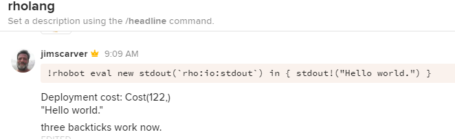

# rhobash
rho calculus bots in bash

Bash on nix systems provides a most powerful but dangerous canapy for other languages and tools.
- command names with arguments separated by spaces. a word, "in quotes with spaces $vars etc.\n", 'or exact'
- built in, system and user commands and macros
- embedding other languages
- files, pipes and piping programs output | to program input
- powerful regular expressions
- a million featues and utilities, takes a minute to learn and a lifetime to master

[Rholang](http://rholang.org) - language of reflective process calculus for algorithmically controlled process orchestration.

[keybasebot.sh](keybasebot.sh) - [CoLab](https://docs.google.com/document/d/1YnXr8zx-0Wv8mSule1GXTvs1BVayEs0wKjovC-9EMOQ/edit) [RChain](https://RChain.coop) Rholang bot on keybase

rhobash?

send: proc > pipe &

receive: proc < pipe &

TODO: complete [MacRhoLang](
